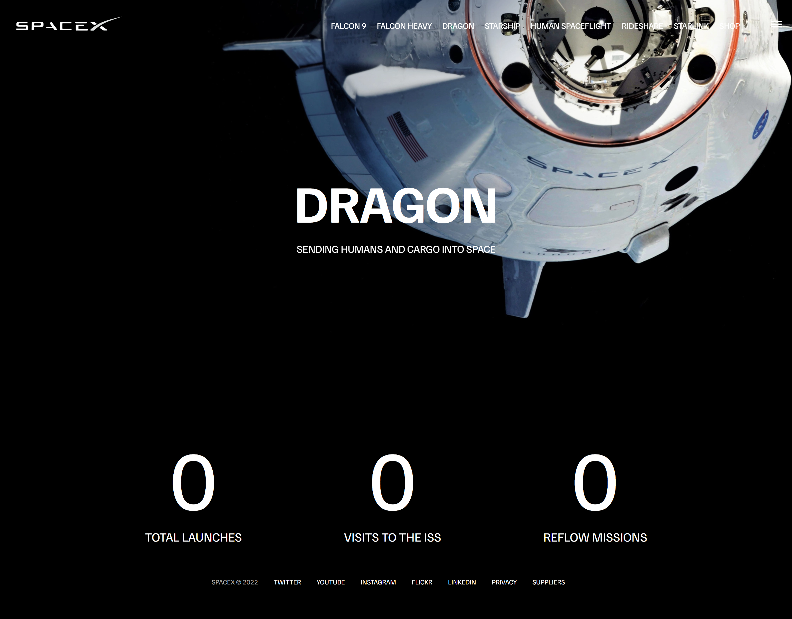
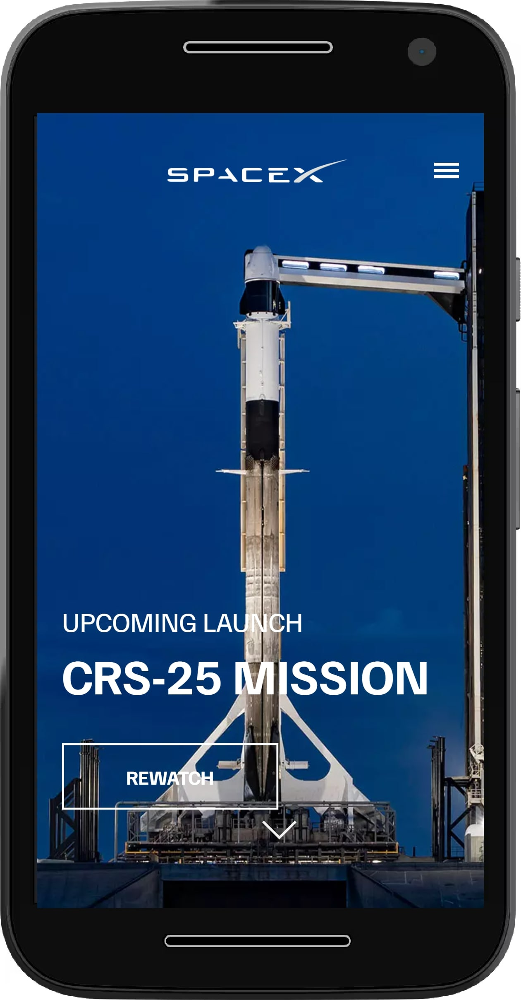

# SpaceX Website Clone

> This project is a clone of the SpaceX homepage, including a few inner pages like Dragon, Falcon 9, and Falcon Heavy. It has been created using HTML, CSS, and JavaScript, with the addition of CSS animations. The primary objective of this project is to replicate the appearance and functionality of the original SpaceX website. Furthermore, it has been designed to be fully responsive, ensuring a consistent user experience across various devices.

## Screenshots

### Desktop View

#### Homepage

#### Falcon-9 page

#### Falcon Heavy page

#### Dragonpage

### Mobile View

  

## Features

- Replicates the appearance and layout of the SpaceX homepage.
- Provides interactive elements and animations for a dynamic user experience.
- Fully responsive design to adapt seamlessly to different screen sizes and devices.
- Utilizes HTML, CSS, and JavaScript to build the project.
- Incorporates modern web development techniques and best practices.

## Technologies Used

- HTML
- CSS
- JS
